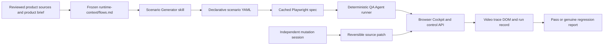

# FlytBase Cockpit QA Agent: L1 Architecture and Evaluation

## Submission Summary

This document describes a reusable, scenario-driven Level-1 QA system for the FlytBase Cockpit. L1 evaluates whether a testing system can detect deliberate changes that create incorrect user-facing behavior. The system is designed around that requirement: it freezes reviewed product behavior, generates durable scenarios, compiles them into executable Playwright tests, runs them deterministically, preserves video and trace evidence, and validates detection against independent mutations.

The system targets the implemented Cockpit experience: connected drones, live telemetry, flight state, map controls, video availability, alerts, and socket recovery. It does not claim coverage for product capabilities that are not present in this prototype, such as authentication, multi-user incident history, persistence, or permissions.

## Product Context

The product is a live incident-response cockpit. An operator must be able to tell which drones are connected, select a device, understand its current flight state and telemetry, see whether video is available, receive warnings, and continue operating when the connection briefly recovers. A wrong status, stale value, missing device, incorrect feed state, or failed reconnect can materially affect an incident response.

The evaluation material defines L1 as static UI and basic security testing, with deliberate mutations introduced into the product. The required evidence is an evaluation document containing a system design and numbered scenarios. Every submitted scenario needs a reproducible flow and a real-time video.

## System Architecture



### Product under test

The Cockpit is a React/Vite frontend backed by an Express control API, socket fan-out, and a deterministic drone simulator. The simulator publishes device lists, flight status, telemetry, alerts, and video state. The backend exposes control endpoints used only to establish deterministic preconditions and actions. Playwright observes the user-facing Cockpit DOM.

### QA package

| Component | Responsibility |
| --- | --- |
| `runtime-context/flows.md` | Reviewed behavioral oracle. It defines exact user-visible expectations and anchors. |
| `skills/scenario-generator/SKILL.md` | Inspects the oracle and source risk, then writes focused YAML scenarios without running the app or changing product code. |
| `skills/qa-agent/SKILL.md` | Compiles or reuses cached specs, executes them, captures evidence, and permits one bounded locator repair. |
| `BLUEPRINT.md` | Defines the repository contract, scenario schema, execution state machine, evidence rules, and mutation boundaries. |
| `scenarios/*.yaml` | Durable scenario intent: category, preconditions, actions, expected behavior, assertions, and flow anchor. |
| `tests/*.spec.ts` | Cached executable Playwright tests generated from the YAML. Their headers contain scenario hash, version, and flow anchor. |
| `playwright.config.ts` | Configures the test directory, Cockpit URL, timeouts, and browser execution. |
| `mutations/*.patch` | Reversible deliberate regressions used to validate that scenarios detect known-bad behavior. |
| `evidence/`, `test-results/`, and `logs/runs/` | Video, trace, failure diagnostics, and immutable run metadata. |
| `.codex-plugin/plugin.json` and `.mcp.json` | Register the reusable QA plugin, skills, and optional Playwright MCP diagnostics. |

## How the Skills Work

### Scenario Generator

The Scenario Generator reads the frozen flow oracle first, then inspects the relevant Cockpit source for risk and stable selectors. It converts one user workflow into one focused YAML scenario. It must use an existing flow anchor, preserve expected behavior from the oracle, avoid duplicate user impact, and never invent behavior from implementation code alone. It does not start services, use browser automation, write Playwright specs, or modify application code.

The generation context is deliberately layered:

1. The product brief supplies the operator goal and operational impact.
2. The source code, README, and reference documentation identify implemented UI states, API actions, telemetry, and stable test IDs.
3. `runtime-context/flows.md` freezes the reviewed observable behavior.
4. The scenario schema expresses deterministic setup, actions, and assertions.
5. Existing run and procedural records prevent duplicate or unsupported scenarios.

### QA Agent

The QA Agent treats a scenario and its flow anchor as immutable test intent. It compiles a Playwright spec when no matching spec exists, when the scenario hash changes, or when a previous locator repair requires regeneration. Otherwise it executes the cached spec directly.

Before every run it clears faults, resets and starts the simulator, loads the Cockpit, and performs the scenario action. The executable test is the source of truth for pass/fail. A passing run is not rechecked by an LLM. On failure, diagnostics may be inspected and exactly one locator repair is allowed only when there is one visible, enabled candidate matching the remembered role, name, or test ID. The expected behavior and oracle cannot be changed to make a mutation pass.

### Browser MCP

Playwright MCP is optional diagnostic infrastructure. It may inspect live DOM, console output, and network failures while authoring or diagnosing a failed test. It does not replace the cached Playwright spec, and its isolated browser state is not used as durable evidence. The reproducible CLI run records the scenario evidence.

## Scenario Coverage

Eight scenarios were generated from the implemented Cockpit flows. They are intentionally broad across the available L1 surface, while remaining precise enough to catch mutations without asserting unsupported product behavior.

| ID | Category | Scenario and user expectation | Main mutation classes detected |
| --- | --- | --- | --- |
| 0001 | State and functional UI | Takeoff changes the selected drone from `taking_off` to visible `in_flight`. | Wrong flight-status mapping, missing state transition, stale status, incorrect API-to-UI mapping. |
| 0002 | Functional UI | Selecting Drone 2 updates the telemetry and FPV panel headers to Drone 2. | Selection state not propagated, wrong-device rendering, stale detail panels. |
| 0003 | Telemetry and API/data | The selected drone shows standby status, battery, altitude, speed, heading, wind, and home-distance values. | Missing fields, malformed payload mapping, wrong source, empty or stale telemetry. |
| 0004 | Video/media state | Disabling Drone 1 video shows the explicit `off` and `Video off` UI state. | Enabled/off mismatch, missing unavailable state, incorrect video payload rendering. |
| 0005 | Network recovery | After a server socket kick, the Cockpit returns to `socket connected`. | Reconnect failure, incorrect connection badge, socket lifecycle regression. |
| 0006 | Visual UI and devices | Opening the Cockpit loads the socket, Drone 1, Drone 4, and their status pills. | Missing device rows, failed initial load, missing visible status, device-list regression. |
| 0007 | Map/geospatial UI | The map renders and the operator can activate the 2D view. | Blank map, broken map control, view-state regression, unusable map surface. |
| 0008 | Functional UI and alerts | A takeoff alert appears with the Drone 1 identifier and message. | Lost alert event, wrong attribution, incorrect alert text, missing toast. |

### Scenario Videos

Each scenario has a baseline recording from the clean run:

| ID | Video |
| --- | --- |
| 0001 | [video](https://drive.google.com/file/d/1g-CGJNN1q1dv33ufPT7Zy3UFIMAfNRyI/view?usp=drive_link) |
| 0002 | [video(1)](https://drive.google.com/file/d/1g-CGJNN1q1dv33ufPT7Zy3UFIMAfNRyI/view?usp=drive_link) |
| 0003 | [video(2)](https://drive.google.com/file/d/1g-CGJNN1q1dv33ufPT7Zy3UFIMAfNRyI/view?usp=drive_link) |
| 0004 | [video(3)](https://drive.google.com/file/d/1g-CGJNN1q1dv33ufPT7Zy3UFIMAfNRyI/view?usp=drive_link) |
| 0005 | [video(4)](https://drive.google.com/file/d/1g-CGJNN1q1dv33ufPT7Zy3UFIMAfNRyI/view?usp=drive_link) |
| 0006 | [video(5)](https://drive.google.com/file/d/1g-CGJNN1q1dv33ufPT7Zy3UFIMAfNRyI/view?usp=drive_link) |
| 0007 | [video(6)](https://drive.google.com/file/d/1g-CGJNN1q1dv33ufPT7Zy3UFIMAfNRyI/view?usp=drive_link) |
| 0008 | [video(7)](https://drive.google.com/file/d/1g-CGJNN1q1dv33ufPT7Zy3UFIMAfNRyI/view?usp=drive_link) |

These scenarios are strongest in visual UI, functional UI, API-driven UI state, telemetry, and basic recovery. Map and video are covered at the implemented UI-state level, not as deep geospatial accuracy or media playback testing. This is an intentional L1 boundary, not a claim of exhaustive coverage of every category in the evaluation brief.

## End-to-End Evaluation Flow

1. The stack is checked through `GET http://localhost:4000/api/health`; simulator and video must be available.
2. The scenario-generation session reviews source behavior and the frozen flow oracle, then creates the eight YAML scenarios.
3. The same session compiles each scenario into a cached Playwright spec. The spec stores the scenario SHA-256 and target flow anchor in its header.
4. The clean application is run first. Each scenario resets the simulator, clears faults, performs its deterministic API setup, drives the Cockpit, and records video and trace evidence.
5. A separate mutation session is given the product source and the target behavior, but is not allowed to inspect the scenario YAML, cached tests, scenario hashes, or QA evidence. It introduces realistic reversible source patches that model regressions from ordinary code changes.
6. The mutation is applied and the application is rebuilt or restarted so the mutated code is live.
7. The original scenario-generation/testing session reruns the unchanged cached Playwright specs. It does not revise the scenario, assertion, or oracle to accommodate the mutation.
8. A failed assertion is classified as a genuine regression only when the observed UI violates the exact frozen flow expectation. The failure retains video, trace, screenshot/DOM diagnostics when available, and the run metadata.
9. The mutation is reverted, the application is rebuilt, and the clean scenario is rerun to prove the detector is specific to the injected regression.

## Mutation Validation

The mutation patches are an independent evaluation layer, not part of scenario intent. Current reversible examples include:

- `status-label-wrong.patch`: maps a real airborne status to the visible `standby` label. Scenario 0001 detects the mismatch because it expects `in_flight` and observes `standby` after the normal `taking_off` transition.
- `status-not-updating.patch`: models a status display that remains wrong after the simulator changes state.
- `takeoff-button-disabled.patch`: models a control-panel action becoming unavailable even when the drone is on the ground.

The demonstrated mutation result is reproducible with the unchanged scenario 0001. The clean run passed, the mutated run failed at `[data-testid="status-flight"]`, and the failure preserved a video and trace under `qa-agent/test-results/mutation-status-label-wrong/`. The application was then restored and the clean scenario passed again.

A mutation that survives is a coverage finding, not a pass. For example, a control-panel-only mutation is not covered by a Cockpit scenario that sends its command through the API. The evaluation reports detected and surviving mutations separately to preserve precision and avoid false claims.

## Evidence and Reproducibility

Each executable test uses Playwright video and trace capture. The scenario and test files identify the exact flow, selectors, action, and expected value. The control API establishes repeatable simulator state, while the browser assertion proves the user-visible result.

The passing prototype run is recorded in `logs/runs/20260926-133333-0001.json`. Newly compiled scenario runs produce evidence under `test-results/`, including videos and traces for scenarios 0006, 0007, and 0008. Mutation evidence is kept in its own output directory so a clean rerun does not overwrite the failure artifacts.

The practical commands are:

```text
cd qa-agent
npm test -- 0001-takeoff-in-air.spec.ts
npm test -- 0006-cockpit-loads-devices.spec.ts 0007-map-view-switch.spec.ts 0008-alert-toast-display.spec.ts
```

The stack must be running on Cockpit port 4010 and backend port 4000. A valid baseline requires the health endpoint to report `simulator: connected` and `video: up`.

## L1 Criteria Mapping

| L1 criterion | How this system addresses it |
| --- | --- |
| Validity | Assertions target real operational states such as `in_flight`, connected, video off, populated telemetry, and visible alerts. |
| Reproducibility and evidence | Simulator reset/start, fault clearing, API actions, cached specs, video, trace, and run records define repeatable execution. |
| Product understanding | Scenarios connect operator actions to drone state, telemetry, map, video, alerts, and connection status. |
| Breadth | The eight scenarios cover devices, states, live data, media state, map controls, alerts, and recovery within the implemented Cockpit. |
| Depth and impact | Takeoff, telemetry, and recovery represent decisions an incident operator must make from live information. |
| Precision | Stable test IDs and exact expected values reduce false positives; mutation judgment cannot rewrite the oracle. |

## Scope and Limitations

This is an L1 Cockpit submission, not a complete end-to-end incident-management test platform. The source product does not implement sign-in, incident creation, multi-user participants, closed history, permissions, or persistence, so those categories are excluded rather than simulated. Responsive mobile layout, true media playback quality, map-coordinate correctness, load/performance, and long-running resource behavior are also outside the current executable scenario set.

The reusable feature is the QA package itself: a future Cockpit flow can be added by reviewing the oracle, creating one focused scenario YAML, compiling its cached spec, and validating it against independent mutations. The central guarantee is not that every possible bug is detected; it is that covered user-visible regressions are detected deterministically, with evidence, without changing the expected behavior to fit the mutation.
